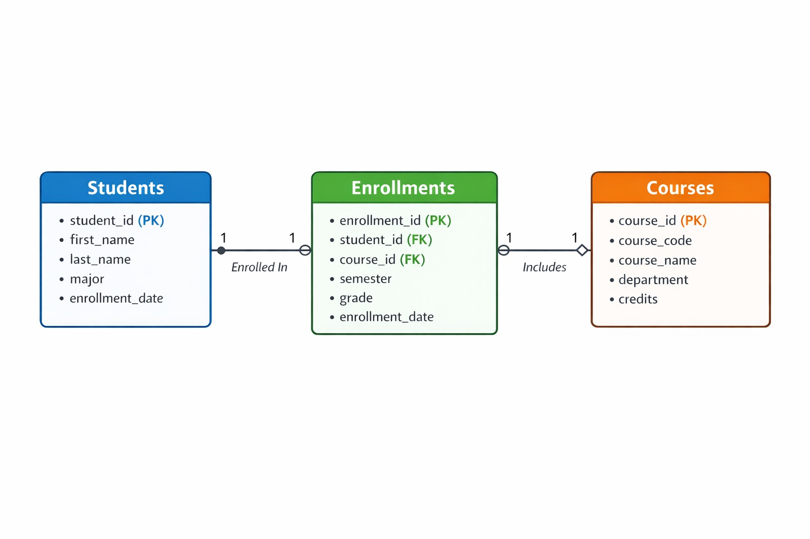
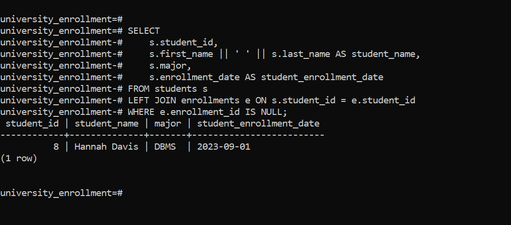
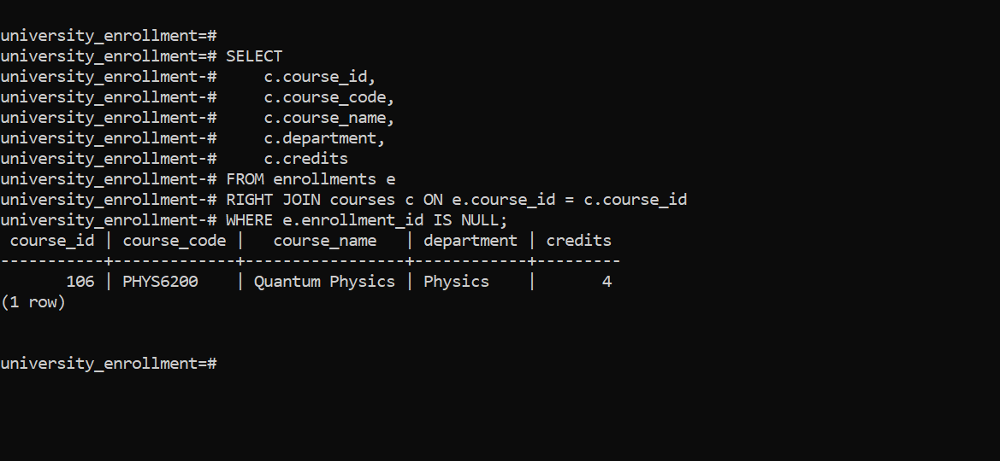
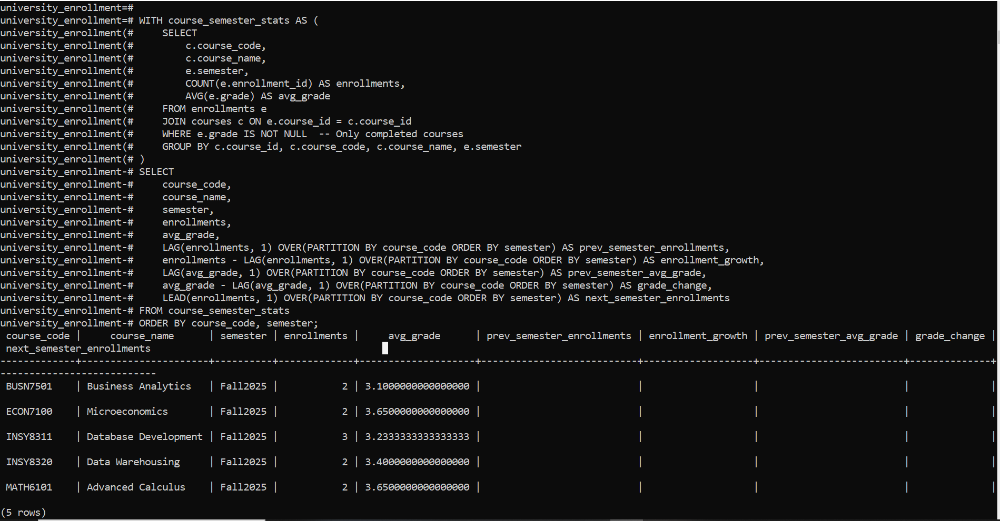
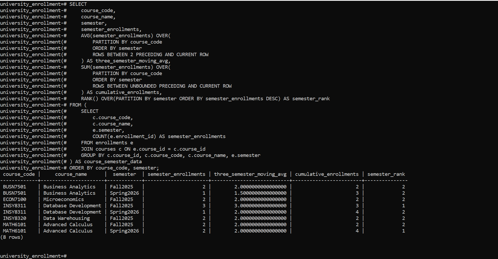

# University Course Enrollment Analytics Database

## Overview

This project delivers a **centralized SQL-based analytics database** designed to help a mid-sized private university (5,000+ students, multiple campuses) optimize its **course enrollment system**. By integrating siloed departmental data into a single analytical model, the database enables data-driven decisions around **course popularity, student performance trends, resource allocation, and early academic intervention**.

The solution focuses on **descriptive, diagnostic, and predictive analytics** to support academic planning and student success initiatives.

---

## Business Problem

### Context

The university operates across multiple campuses and departments, but enrollment and academic data is fragmented. This fragmentation makes it difficult to:

* Identify **popular vs. under-enrolled courses**
* Track **student performance trends** over time
* Allocate **teaching staff and classrooms efficiently**
* Detect **at-risk students early**

### Core Challenges

* Lack of integrated enrollment and performance analytics
* Limited visibility into cross-departmental trends
* Reactive (instead of proactive) academic decision-making

---

## Data Challenges Addressed

The database enables the university to:

* Monitor enrollment patterns across **departments, semesters, and campuses**
* Identify courses with **declining or increasing popularity**
* Segment students by **academic performance** for targeted support
* Analyze historical trends to **predict future enrollment demand**

---

## Expected Outcomes

Actionable insights generated from this database support:

* Optimized **course scheduling and faculty assignments**
* Data-driven **student support and intervention programs**
* Improved **classroom and resource utilization**
* Increased **student retention and graduation rates**

---

## Database Scope

The database models real-world university operations, including:

* Students and academic profiles
* Departments and courses
* Enrollment records by semester
* Grades and performance metrics
* Faculty and teaching assignments *(optional / extensible)*

The schema is optimized for:

* Complex JOIN operations
* Aggregations and trend analysis
* Window functions for ranking and performance tracking

---

## Entity Relationship Diagram (ERD)

> 


## Key Analytics & Use Cases

This project implements **real-world academic analytics** using advanced SQL techniques, including **JOINs and Window Functions**, directly mapped to business needs.

### 1. Enrollment Visibility (SQL JOINs)

* **INNER JOIN** to retrieve complete enrollment records with student and course details
* **LEFT JOIN** to identify students with no enrollments (potential dropouts)
* **RIGHT JOIN** to detect courses with zero enrollment (underutilized resources)
* **FULL OUTER JOIN** for a comprehensive audit of unmatched students and courses
* **SELF JOIN** to group students by major and enrollment period for peer analysis

**Business Value:** Improves visibility into participation gaps, unpopular courses, and inactive students.

### 2. Course Popularity & Demand Analysis (Ranking Functions)

* `ROW_NUMBER`, `RANK`, `DENSE_RANK`, `PERCENT_RANK`
* Top courses by enrollment **per department**

**Business Value:** Supports data-driven course scheduling and faculty allocation.

### 3. Enrollment Trends & Growth Tracking (Aggregate Windows)

* Running totals of enrollments by department and semester
* Moving averages to smooth enrollment fluctuations

**Business Value:** Enables proactive planning for classrooms, instructors, and infrastructure.

### 4. Semester-over-Semester Performance Analysis (Navigation Functions)

* `LAG` and `LEAD` to track enrollment growth and grade changes

**Business Value:** Identifies improving or declining courses early.

### 5. Student Performance Segmentation (Distribution Functions)

* GPA-based student segmentation using `NTILE(4)` and `CUME_DIST`
* Classification into performance tiers (Top Performer → Needs Improvement)

**Business Value:** Enables early academic intervention and targeted support programs.

---

## Implemented SQL Queries

This project includes **production-ready SQL scripts** covering schema design, data population, and advanced analytics.

### Schema & Constraints

* Normalized relational design (Students, Courses, Enrollments)
* Primary keys, foreign keys, cascading deletes
* Data integrity via `CHECK` and `UNIQUE` constraints

### JOIN Queries

* Enrollment reporting with student & course metadata
* Detection of unenrolled students and unused courses
* Peer grouping using self-joins

### Window Function Categories

| Category     | Functions Used                                     | Purpose                          |
| ------------ | -------------------------------------------------- | -------------------------------- |
| Ranking      | `ROW_NUMBER`, `RANK`, `DENSE_RANK`, `PERCENT_RANK` | Course popularity comparison     |
| Aggregation  | `SUM() OVER`, `AVG() OVER`                         | Trend and growth analysis        |
| Navigation   | `LAG`, `LEAD`                                      | Semester-over-semester changes   |
| Distribution | `NTILE`, `CUME_DIST`                               | Student performance segmentation |

>**All queries are PostgreSQL-compatible and ready to run.**

---

## Screenshots & Visual Evidence

>
---
>
---
>
---
>
---
>
---
>
---
>
---
>
---
>
---
>

## Technology Stack

* **Database:** PostgreSQL / MySQL / Oracle (configurable)
* **Language:** SQL
* **Tools:** pgAdmin / SQL Developer / DBeaver
* **Optional Visualization:** Power BI / Tableau / Metabase

---

## How to Run the Project

1. Clone the repository

   ```bash
   git clone <repository-url>
   ```

2. Create the database

   ```sql
   CREATE DATABASE university_enrollment;
   ```

3. Connect to the database and run the setup script

   ```sql
   -- Tables, constraints, and sample data
   ```

4. Execute analytical queries

   * JOIN-based reporting queries
   * Window function analytics (ranking, trends, segmentation)

5. Review outputs and capture screenshots for documentation

---

## Conclusion

This project demonstrates how a well-designed relational database can transform fragmented academic data into **actionable intelligence**. By enabling visibility into enrollment patterns and student performance, the university can make **smarter, faster, and more impactful academic decisions**.

---

*Author:* **Uwambaje Gad**
*Project Type:* Academic Analytics / SQL Database Design
*Status:* Ready for extension and production hardening
